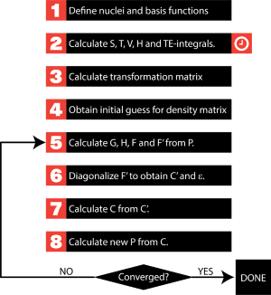
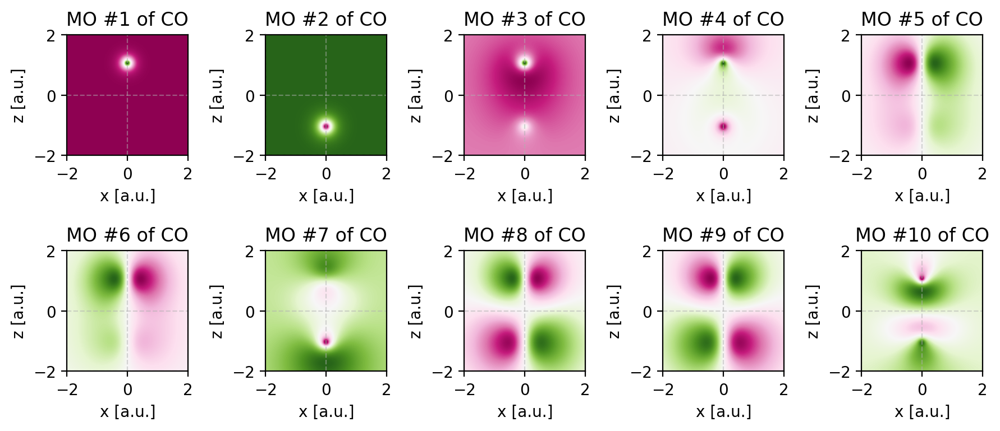
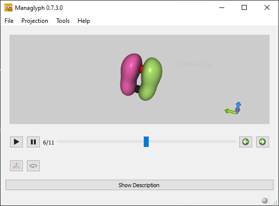

# Hartree-Fock course for the Han-sur-Lesse Winterschool of 2021

[](http://creativecommons.org/licenses/by-nc/3.0/)

## Purpose
The set of exercises and scripts in this repository are used for the interactive
workshop to get acquainted with the intricacies of Hartree-Fock calculations. The
reader at least be comfortable executing and interpreting Hartree-Fock calculations.
The most proficient student will find the scripts useful in drafting their
own implementation of the Hartree-Fock algorithm. Note that the scripts provided
here focus on clarify and their targeted use case is for educational endeavors.

## Requirements
For going through these exercises, please install the [Anaconda](https://www.anaconda.com/products/individual) suite. 
Next, install [PyQInt](https://github.com/ifilot/pyqint), [PyTessel](https://github.com/ifilot/pytessel) and
Mendeleev by running the following in an Anaconda prompt

```bash
conda install -c ifilot pytessel pyqint
conda install -c conda-forge mendeleev
```

For exercise 8 and further, you will need the [Managlyph program](https://www.managlyph.nl).

## Exercises

Below, a list of exercises is given. To run the Python scripts, it is highly recommended
to use the Spyder IDE which comes readily bundled with the Anaconda package.

### Exercise 01: Integrals for the H atom
This exercise teaches you about contracted Gaussian functions and the various different integrals 
that can be constructed. We start simple by exploring a single H atom which has a single electron.

[Go to exercise 1](exercise01)

### Exercise 02: Integrals for the He atom
We expand upon the previous exercise and start to look into a He atom. He contains two electrons
and as such, a two-electron integral occurs corresponding to the repulsion between these two
electrons. In this exercise, you will learn how to evaluate a two-electron integral and
calculate the total electronic energy for the He atom.

[Go to exercise 2](exercise02)

### Exercise 03: Integrals for the H2 molecule
In this exercise, we are going to evaluate the integrals for the H2 molecule.
Because the H2 molecule has two CGFs (one for each H atom), we are going
to obtain matrices rather than scalar values for the integrals. Instead of a single value 
for the overlap and kinetic integrals, we will obtain 2x2 matrices. For the 
nuclear attraction integral, we in fact obtain two such 2x2 matrices (one for each H atom).
Finally, there will be 16 two-electron integrals which will contain a total
of 4 unique values.

[Go to exercise 3](exercise03)

### Exercise 04: Building the transformation matrix
To perform the SCF algorithm, we need to produce a unitary transformation matrix that
orthogonalizes the basis functions in the basis set. We will use the canonical procedure
for this which is demonstrated in this exercise.

[Go to exercise 4](exercise04)

### Exercise 05: Perform the SCF procedure for H2
In this exercise, we are going to complete the algorithm and build the full
Hartree-Fock algorithm. This is quite a daunting task if you do this for the
first time and as such, we use the concept of 'learning by example'. You are
given a fully working HF code for the H2 molecule and your task is to identify
all the steps in the procedure.

[Go to exercise 5](exercise05)



### Exercise 06: Simulate the CO molecule
With a working implementation for H2, it is logical that we are going to expand
towards non-trivial molecules. Let us stick with two atoms to make matters
not overly complicated and simulate the CO molecule. In this exercise, you are
tasked to modify our earlier implementation to accomplish this goal. Furthermore,
we are going to focus a bit more on the energies of the molecular orbitals
and the linear combination of atomic orbitals that constitute them.

[Go to exercise 6](exercise06)

### Exercise 07: Visualizing molecular orbitals using contour plots
There are two common ways to visualize molecular orbitals and these correspond
to projecting the wavefunction onto a plane (contour plot) or by connecting
all points in three-dimensional space to form a surface (isosurface). In this
exercise, we will explore how to build contour plots.

[Go to exercise 7](exercise07)



### Exercise 08: Visualizing molecular orbitals using isosurfaces
In this exercise, we will visualize the molecular orbitals using
contour plots. Our Python script will generate a .abo file which
can be opened in the Managlyph program, allowing you to easily
browse through the molecular orbitals.

[Go to exercise 8](exercise08)



## License
The Python files are distributed under the [GPLv3 license](LICENSE). All written
texts that accompany the scripts are distributed under the 
[CC BY-NC 3.0 LICENSE](https://creativecommons.org/licenses/by-nc/3.0/).
